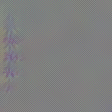

# 3dcnn-vis

Visualizing activations of 3D convolutional filters using keras-vis library.

## Model architecture

|Layer (type)         |        Output Shape         |     Param |   
|---|---|---|
|conv1 (Conv3D)       |        (None, 16, 112, 112, 64) | 5248  |    
|pool1 (MaxPooling3D) |        (None, 16, 56, 56, 64)   | 0     |   
|conv2 (Conv3D)       |        (None, 16, 56, 56, 128)  | 221312|
|pool2 (MaxPooling3D) |        (None, 8, 28, 28, 128)   | 0     |    
conv3a (Conv3D)       |       (None, 8, 28, 28, 256)    |884992 |   
conv3b (Conv3D)       |       (None, 8, 28, 28, 256)    |1769728|   
pool3 (MaxPooling3D)  |       (None, 4, 14, 14, 256)    |0      |   
conv4a (Conv3D)       |       (None, 4, 14, 14, 512)    |3539456|   
conv4b (Conv3D)       |       (None, 4, 14, 14, 512)    |7078400|   
pool4 (MaxPooling3D)  |       (None, 2, 7, 7, 512)      |0      |   
conv5a (Conv3D)       |       (None, 2, 7, 7, 512)      |7078400|   
conv5b (Conv3D)       |       (None, 2, 7, 7, 512)      |7078400|   
zero_padding3d_2 (ZeroPadding)| (None, 2, 9, 9, 512)    |  0    |     
pool5 (MaxPooling3D)  |       (None, 1, 4, 4, 512)      |0      |   
flatten_2 (Flatten)   |       (None, 8192)              |0      |   
fc6 (Dense)           |       (None, 4096)              |33558528|  
dropout_3 (Dropout)   |       (None, 4096)              |0       |  
fc7 (Dense)           |       (None, 4096)              |16781312|  
dropout_4 (Dropout)   |       (None, 4096)              |0       |  
fc8 (Dense)           |       (None, 487)               |1995239 |  

## Weights
Possible to [use the pre-trained model in Caffe format or convert it to Keras format](https://github.com/axon-research/c3d-keras) or simply download model weights in Keras format from [here](https://www.dropbox.com/s/vh293aba931wrk1/sports1M_weights_tf.h5?dl=0).

## 3D CNN cativations of filters

conv1
<table border="0">
		<tr>
			<td></img></td>
			<td></img></td>
			<td></img></td>
			<td></img></td>
		</tr>
 </table>
conv2
<table>
  <tr>
    <td></img></td>
    <td></img></td>
    <td></img></td>
    <td></img></td>
  </tr>
</table>
conv3a
<table>
		<tr>
			<td></img></td>
			<td></img></td>
			<td></img></td>
			<td></img></td>
		</tr>
</table>
conv3b
<table>
        <tr>
			<td></img></td>
			<td></img></td>
			<td></img></td>
			<td></img></td>
		</tr>
</table>
conv4a
<table>
		<tr>
			<td></img></td>
			<td></img></td>
			<td></img></td>
			<td></img></td>
		</tr>
</table>
conv4b
<table>
        <tr>
			<td></img></td>
			<td></img></td>
			<td></img></td>
			<td></img></td>
		</tr>
</table>
conv5a
<table>
    	<tr>
			<td></img></td>
			<td></img></td>
			<td></img></td>
			<td></img></td>
		</tr>
</table>
conv5b
<table>
    	<tr>
			<td></img></td>
			<td></img></td>
			<td></img></td>
			<td></img></td>
		</tr>
</table>
